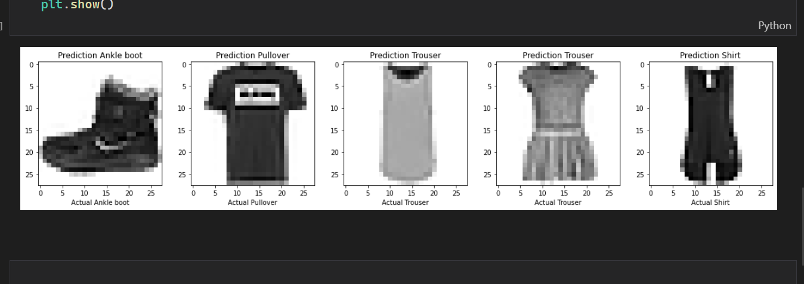

# Fashion Item Classification using Simple ANN

A simple fashion item classification project using ANN in Tensorflow 


## Requirements : 

1. Tensorflow package

```
pip install tensorflow 
```

In case, you are using GPU , make sure to install CUDA package and CUDA dnn package. To install GPU compatible version of tensorflow : 

```
pip install tensorflow-gpu
```


## Screenshots 

<br>



