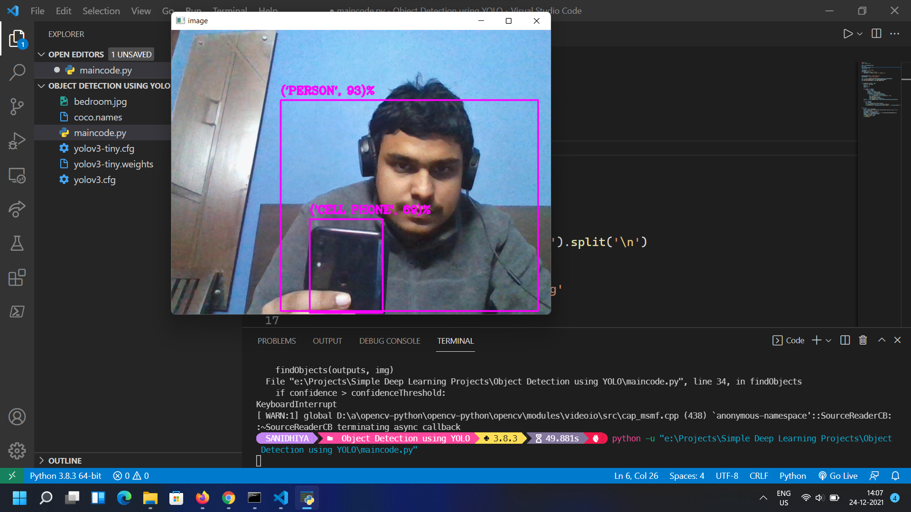

#  Object Detection using YOLO v3

A simple object detection project using pre-trained YOLO neural network and COCO dataset

## Steps to run on your system:

1. Install following packages using pip command : 

```
pip install python-opencv
pip install numpy 
```

2. Download Yolo Weights, Configuration files and coco names.

3. Run as a python script


## Demonstration 
<br>
