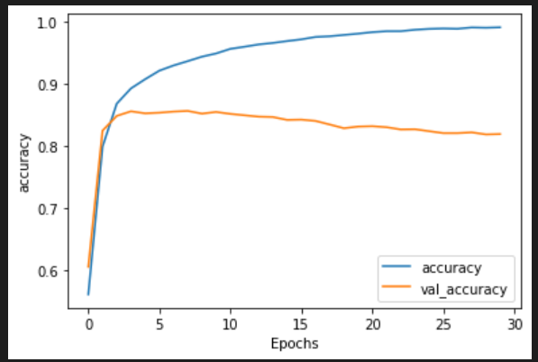
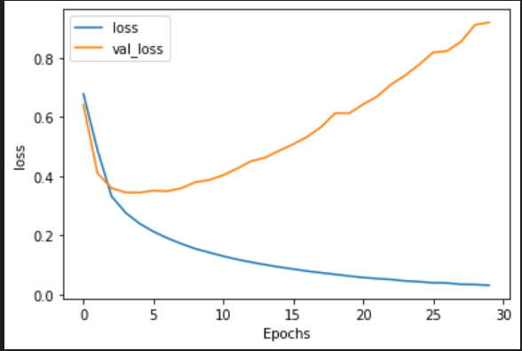

## Sarcasm Detection in Text using ANN (Tensorflow)


## Requirements : 

1. Tensorflow package

```
pip install tensorflow 
```

In case, you are using GPU , make sure to install CUDA package and CUDA dnn package. To install GPU compatible version of tensorflow : 

```
pip install tensorflow-gpu
```


## Network Performance Analysis

| Accuracy and Val Accuracy with epochs             |  Loss and Val Loss with epochs |
:-------------------------:|:-------------------------:
  |  
